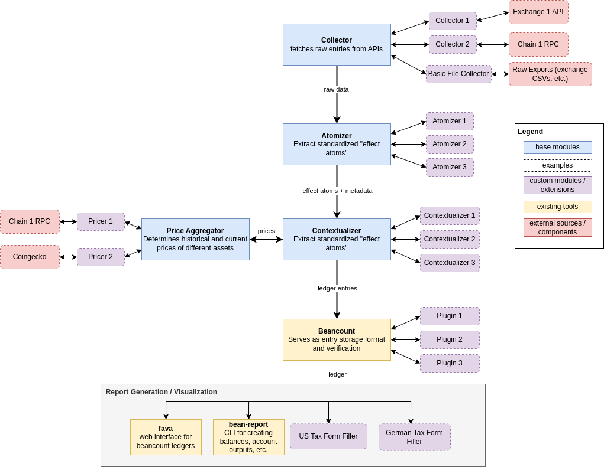

# Power Bohne

**Disclaimer:** I'm neither a tax advisor or professional accountant, use at your own risk

A set of importers and plugins for beancount to facilitate the booking of
Cryptocurrency and DeFi related transactions in Beancount.

## Progress: 🚧

This code is highly unstable, undergoing frequent refactors, updates and expansions. Furthermore it
has not been published to PyPI yet so beware of any packages that may pretend to be this repository.

## How to Use

This repo is not really meant for general use yet, it has no documentation and the features
/ capabilities are mostly tailored to my needs but I may generalize and/or document these tools in
the future.

## Future Plans

As mentioned above I think it'd be really cool to have an open-source, free, transparent and self
hostable accounting / tax tool for DeFi and crypto more broadly. I have spent a little time
brainstorming a potential architecture and pitching it to people who are developing tools in
a similar direction such as [https://defitaxes.us/](https://defitaxes.us/) but so far I haven't
really found anyone who's developing such a tool open-source.

The architecture would be something like this:

### Why Open Source?

If you're a user or tax tool dev you might ask why should a crypto / DeFi tax tool be open-source
outside of trying to adhere to some crypto ethos?

There are several reasons why I think an open-source crypto / accounting tool would be successful
and eventually serve to out compete **all** existing tools:

- free contributions: whether bugs or security flaws, open-source allows anyone to come along and
  submit improvements to existing code
- niche features: The problem with a lot of crypto tax / accounting tools is that they're always
  missing some feature or protocol, with an open-source standard & tool the users of that protocol
  could add it themselves benefiting everyone else, as usage grows may project teams themselves will
  opt to write adapters for their DeFi protocols
- jurisdictional diversity: outside of supporting niche DeFi protocols this would also allow the
  tool to easily support many diverse jurisdictions as people extend the tool to adjust the
  accounting tools and plugins to match their local laws
- auditability: an open-source accounting tool with set standards can give financial auditors more
  confidence when auditing an organization using such a tool as they could easily verify the base
  inputs and run it through to catch discrepancies
- customizability: due the lack of clarity in most jurisdictions world wide when it comes how to
  account let alone tax various exotic DeFi transactions, it'd be useful to allow for organizations
  to adjust, share and improve different tools and standards as their interpretation of untested
  laws may differ

As a last and important point I'd mention that just because a tool is open-source doesn't mean it
can't be commercialized, the self-hosted version will likely require some technical knowledge. From
installing the necessary packages and configuring the different modules of the system they'll
definitely be room for  Vercel / Github type buisnesses that monetize a free open-source tools by
creating a user-friendly and visual UI around it.

